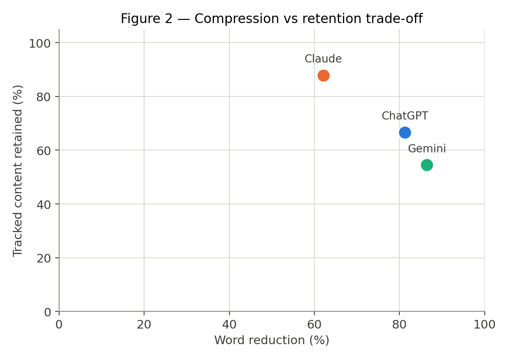
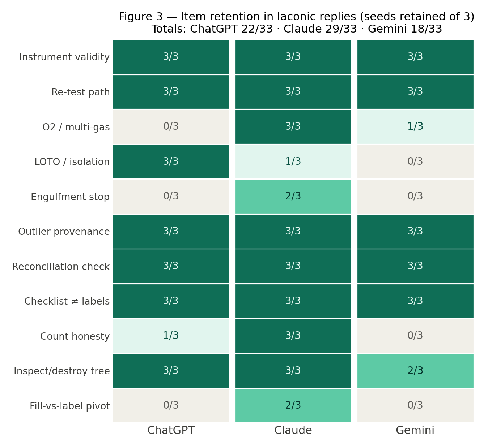
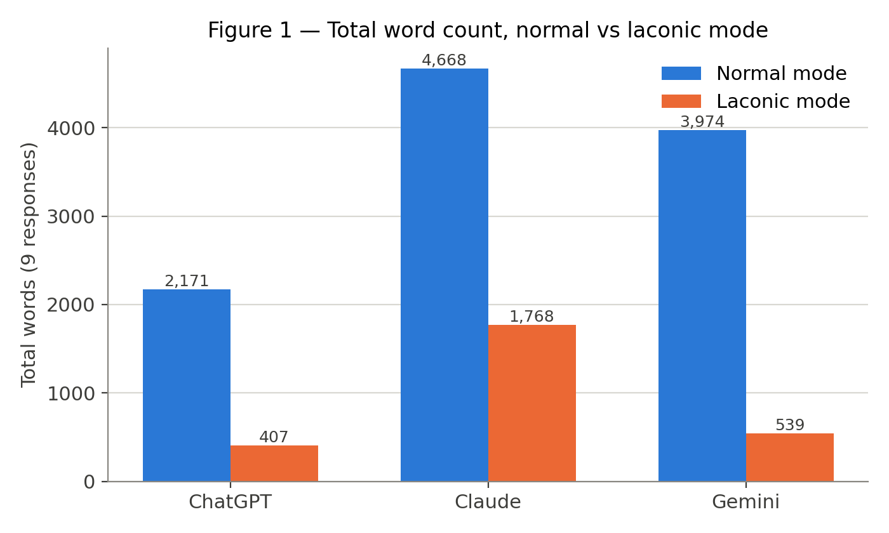

# Laconic_tests

An A/B test of a "laconic" LLM instruction block: how much verbosity it removes, and what that compression costs. Three models (ChatGPT 5.5, Claude Opus 5, Gemini 3.1 Pro, all with extended thinking), three safety-decision prompts built so a dropped detail is expensive, three independent seeds per cell, both modes — 54 responses, scored against keys pre-specified before generation.

## Headline results

| Model | Word reduction | Content retained | Verdict gate |
|---|---|---|---|
| ChatGPT | 81.3% | 22/33 | 9/9 |
| Claude | 62.1% | 29/33 | 9/9 |
| Gemini | 86.4% | 18/33 | 9/9 |

Every laconic reply reached the keyed decision honestly (27/27). What differs is what survives compression. Both hard compressors lose the engulfment stop and the fill-vs-label pivot entirely (0/3 each), and each drops more on its own — ChatGPT the O2/multi-gas check, Gemini lockout and count honesty. The model that retains most stays 3-4x more verbose. Nobody gets both: with these three models on these prompts, the upper-right corner stays empty — none combined the strongest compression with the highest measured retention.



## The directive (v2, final)

> Laconic mode. Answer in as few words as the subject allows. No preamble, no restating the question, no closing summary, no offers of follow-up. State the result, then stop.
>
> Lead with the number, the verdict, or the decision. Supporting reasoning only if it changes what the user would do.
>
> Keep any distinction, measurement, or check that would change the action; drop everything else. Drop reflexive hedging.
>
> Prose, not lists or headers, unless structure is the answer (e.g., a handoff, a BOM, a step sequence).
>
> Brevity never overrides rigor. Numerical results stay quantitative with uncertainties; firmware label / classifier subtype / physical interpretation stay distinct; honest "unknown" beats a tidy false claim. When correctness needs length, take the length — and not one line more.
>
> Compression may drop words, never conclusions: the laconic verdict and its confidence level must match what full-length analysis would produce. Unknowns stay unknown.
>
> Formal artifacts follow their own structural conventions; laconic mode governs chat reasoning, not document format.
>
> Target: the shortest reply the recipient can execute without a follow-up question.
>
> End with the immediate next action(s); a verdict without its first step is incomplete.

## This is a base, not a drop-in

The directive was tuned for lab and safety work where a dropped detail costs you. As written it strips formatting (bullets, headers), bans closing summaries, and carries one domain-specific line. If your work doesn't have the dropped-detail-costs-you property, it is over-engineered for you. **Read [docs/adapting.md](docs/adapting.md) before installing it** — it maps every clause to its function, marks which are invariant and which are style, gives drop-in replacement lines (including how to re-allow bullets and summaries), and includes a re-test protocol for validating your edits.

## What compression costs, item by item

Figure 3 is the detail behind the trade-off: eleven tracked items, each cell the number
of three seeds that carried it. The uniform top rows are the verdict-critical core — all
three models hold it. The pale cells are what Claude's extra ~145 words per reply are
buying, and they are mostly not sampling noise: 27 of the 33 model-item cells are
unanimous across seeds (0/3 or 3/3), so where a model drops an item it usually drops it
every time. Read the columns rather than generalizing — lockout/isolation is a Gemini
loss (ChatGPT holds it 3/3), and the reconciliation check survives everywhere.



Figure 1 shows the raw volume the reduction percentages are computed from. The
normal-mode baselines differ enough between models (2,171 to 4,668 words) that reduction
percentages are only comparable as ratios, not as absolute savings — and Claude's laconic
total, 1,768 words, is still 3-4x either competitor's.



## How it was built and tested

v1 failed in round 1: one model inverted a destroy/release verdict under compression and fabricated a probability; another delivered a 22-word answer to a destroy/release decision with no protocol. Four amendments produced v2 (verdict invariance, action floor, sharpened retention test, sufficiency target). v2 was validated on three fresh prompts with scoring keys pre-specified before generation, then replicated at n=3 seeds per cell. One arm was invalidated mid-test by instruction-layer contamination (profile preferences apply even in incognito chats) and rerun clean. Full narrative: [docs/methodology.md](docs/methodology.md). Scoring: [docs/scoring.md](docs/scoring.md).

## Repo map

```
directive/        v1, v2 (final), changelog with rationale
prompts/          round-1 shakedown set, round-2 scored set with keyed verdicts
docs/             methodology.md · scoring.md · adapting.md
data/raw/         original pasted transcripts, untouched (provenance)
data/responses/   54 normalized replies, one file each, YAML front matter
results/          word_counts.csv · scores_items.csv · summary.md
figures/          the three figures
scripts/          parse_transcripts.py · validate_corpus.py · make_figures.py · blind_export.py
```

## Reproduce

```
python scripts/parse_transcripts.py   # raw -> responses + word_counts.csv (stdlib only)
python scripts/validate_corpus.py     # integrity gate: cells, duplicates, count agreement
pip install -r requirements.txt       # matplotlib + numpy, for figures only
python scripts/make_figures.py        # results -> figures
```

Figures are content-reproducible, not byte-reproducible: matplotlib renders slightly
different PNG bytes across versions and font sets, so regenerating will show a diff even
when nothing changed. Pin the versions in requirements.txt if you need identical bytes.

Scoring against the keys is human judgment by design; the rubric and keys are in docs/scoring.md. To replicate on your own domain, follow the protocol at the end of docs/adapting.md.

## License and citation

Dual-licensed by content type:

- **Data, prompts, directive, and documentation** — CC BY 4.0 ([LICENSE](LICENSE)).
- **Code in `scripts/`** — MIT ([LICENSE-CODE](LICENSE-CODE)).

Cite via [CITATION.cff](CITATION.cff). Replications welcome — especially instruction sets that hold the checks at a lower word count. If yours does, open an issue; it's a better directive and this repo should say so.
